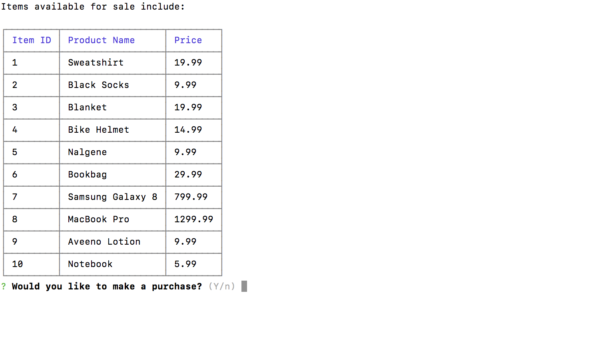
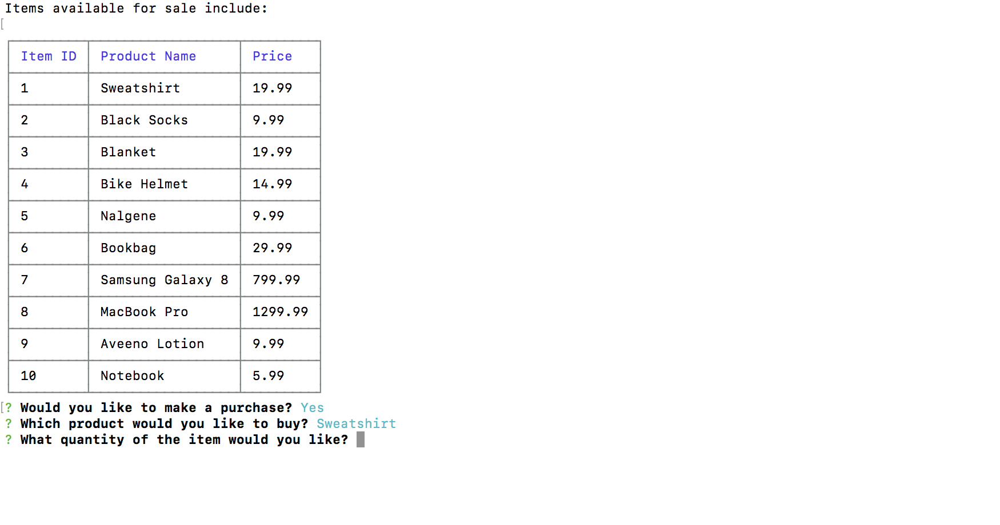
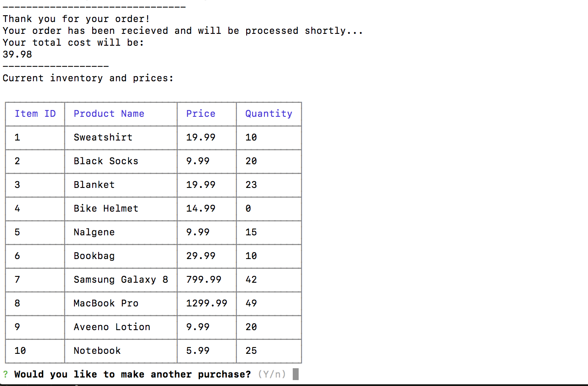
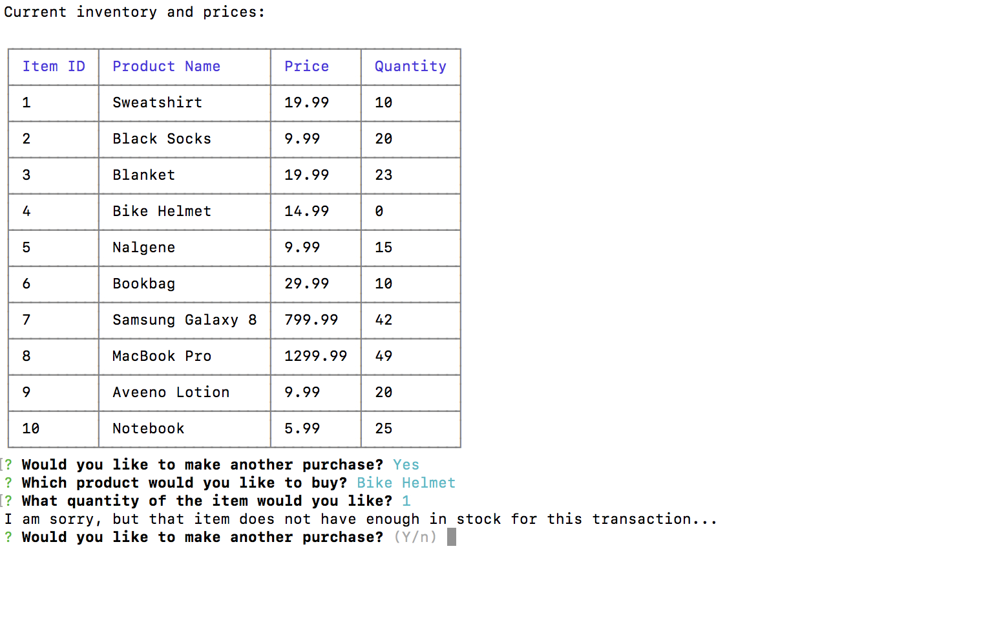
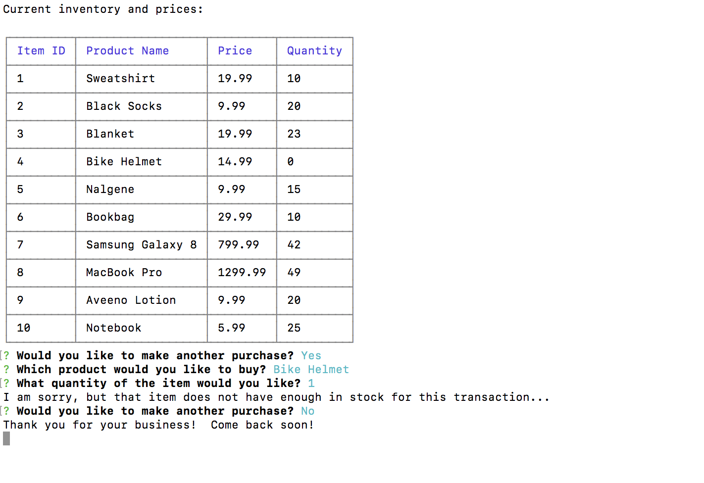

# Welcome to Bamazon

Bamazon is an interactive shopping Node app, that uses Node.js and MySQL to allow its users to view and purchase a varitety of items from its existing stock as a Customer.

***

## Overview

### Bamazon Customer Portal

The Customer aspect of the application will allow the use to view what items are available for purchase.  They will then be prompted whether they would like to make a purchase.  Yes then prompts them to choose which item they would like out of a list of options provided for them, while no will end the process.  Once an item has been chosen, they will then be prompted for the quanity of it.  Following the quantity prompt, it will state that the order is being processed and display their total cost.  As an added function, a tabkle with all the items and their current quantities will be displayed.  The user will then be prompted if they would like to make another purchase; yes will repeated the previously mentioned process, while a no will thank them for their business and end the process.

#### Opening Window

