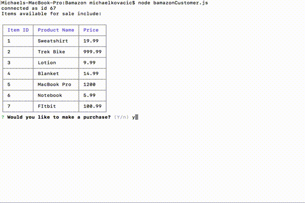
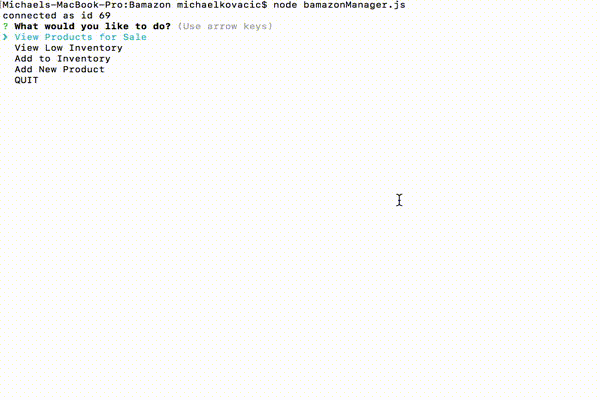
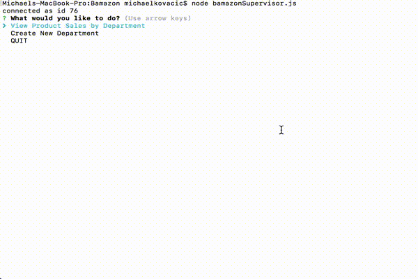

# Welcome to Bamazon

Bamazon is an interactive shopping Node app that uses Node.js and MySQL.  The application has three separate functionalities: the customer portal, the manager portal, and the supervisor portal.

***

## Overview

### Bamazon Customer Portal

The Customer aspect of the application will allow the use to view what items are available for purchase.  They will then be prompted whether they would like to make a purchase.  Yes then prompts them to choose which item they would like out of a list of options provided for them, while no will terminate the process.  Once an item has been chosen, they will then be prompted for the quanity of it.  Following the quantity prompt, it will state that the order is being processed and display their total cost.  The user will then be prompted once again if they would like to make a purchase; yes will repeated the previously mentioned process, while a no will thank them for their business and end the program.

#### Application Progression

***

### Bamazon Manager Portal

The Manager portion of the application uses inquirer prompt to allow the user to navigate through the program.  This portal allows the manager to view products for sale, view low inventory, add to inventory, or add new products.  Viewing products for sale lists out all available products in the database in a cli-table.  Viewing the low inventory will display all products with a stock quanitity of 5 or less.  Adding to inventory allows the manager to add stock to any product, and adding a new product enables the manager to create new products in the database.

#### Application Progression

***

### Bamazon Supervisor Portal

The SUpervisor portion of the application has only two main functions.  First, utilizing two tables, it allows the supervisor to see the overhead costs and profit for each department.  This is accomplished through an inner join of the "departments" and "products" tables.  Second, the supervisor can create a new department on the "departments" table.

#### Application Progression

***

## Contributors
Michael Kovacic

***

## Technologies Used
* Javascript
* MySQL
* NodeJS
* npm Packages:
    * mysql
    * inquirer
    * cli-table

***

## License
Copyright 2018 University of Denver Coding Bootcamp - Michael Kovacic
